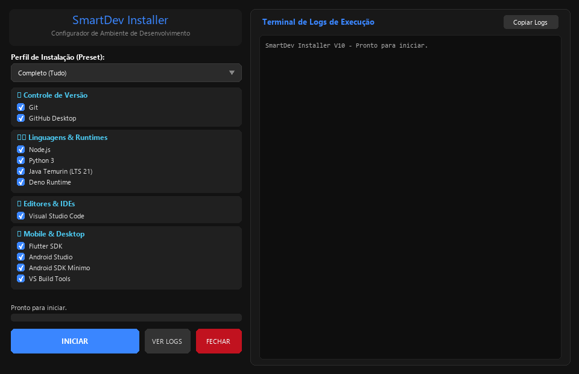

<div align="center">
  
  <h1>SmartDev Installer (Português)</h1>
  <p><strong>Configurador e Instalador Automatizado de Ambiente de Desenvolvimento para Windows</strong></p>

  <p>
    <a href="../LICENSE"></a>
    
    <a href="https://www.paypal.com/donate/?hosted_button_id=T3472SUH7RP52"></a>
  </p>

  <p>
    <b>🌐 Idioma:</b>
    <a href="../README.md">English (Global)</a> |
    <strong>🇧🇷 Português do Brasil</strong>
  </p>

  <br/>
  
</div>

---

## 🌟 Visão Geral

O **SmartDev Installer** automatiza todo o processo de configuração do seu ambiente de desenvolvimento no **Windows 10 e Windows 11**. 

Utilizando o **Windows Package Manager (`winget`)**, interface visual moderna (**CustomTkinter**) e scripts de configuração resilientes, ele instala ferramentas oficiais, configura caminhos no `PATH` e variáveis como `JAVA_HOME` e `ANDROID_HOME` com apenas alguns cliques.

---

## 📦 Ferramentas Suportadas (16 Pacotes)

| Categoria | Ferramenta | ID Winget / Método | Descrição |
| :--- | :--- | :--- | :--- |
| **📦 Controle de Versão** | **Git** | `Git.Git` | Controle de versão distribuído padrão de mercado |
| | **GitHub Desktop** | `GitHub.GitHubDesktop` | Cliente visual oficial do GitHub |
| **⚙️ Linguagens & Runtimes** | **Node.js** | `OpenJS.NodeJS` | Runtime JavaScript baseado no motor V8 do Chrome |
| | **Python 3** | `Python.Python...` | Versão estável mais recente do Python 3 |
| | **Java Temurin** | `EclipseAdoptium.Temurin.21.JDK` | OpenJDK 21 LTS estável (compatível com Gradle e Android) |
| | **Deno** | `DenoLand.Deno` | Runtime moderno e seguro para JavaScript/TypeScript |
| **💻 Editores & IDEs** | **Visual Studio Code** | `Microsoft.VisualStudioCode` | Editor de código leve e extensível |
| **📱 Mobile & Desktop** | **Flutter SDK** | `Flutter.Flutter` | Framework multi-plataforma da Google |
| | **Android Studio** | `Google.AndroidStudio` | IDE oficial para desenvolvimento Android |
| | **Android SDK Min** | `Google.Android.CommandLineTools` | Ferramentas de linha de comando (`sdkmanager`) |
| | **VS Build Tools** | `Microsoft.VisualStudio.2022.BuildTools` | Compiladores C++ e Windows SDK para Flutter e C++ |
| **🌐 APIs & Bancos de Dados** | **Postman** | `Postman.Postman` | Plataforma completa para teste e desenvolvimento de APIs |
| | **DBeaver** | `DBeaver.DBeaver.Community` | Gerenciador universal para bancos SQL e NoSQL |
| | **Supabase CLI** | `Supabase.CLI` / `npm -g` | CLI oficial para desenvolvimento local com Supabase |
| **🐳 Containers & Testes** | **Docker CLI** | `Docker.DockerCLI` | Cliente de linha de comando do Docker |
| | **Playwright CLI** | `@playwright/test` | Framework moderno de testes End-to-End (E2E) |

---

## 🎯 Perfis de Instalação (Presets)

* **Completo (Tudo):** Instala todos os 16 componentes.
* **Desenvolvimento Web & Fullstack:** Git, GitHub Desktop, Node.js, Python, Deno, VS Code, Postman, DBeaver, Supabase CLI, Docker CLI e Playwright CLI.
* **Desenvolvimento Mobile (Flutter & Android):** Git, Java Temurin (LTS 21), Flutter SDK, Android Studio, Android SDK Mínimo, VS Code e Postman.
* **Backend, Cloud & Containers:** Git, Node.js, Python, Deno, VS Code, Postman, DBeaver, Supabase CLI e Docker CLI.
* **Personalizado:** Permite marcar e desmarcar qualquer item livremente.

---

## 🚀 Como Usar

### 1. Usando o Executável Pronto (.exe)
1. Baixe o executável pronto [`SmartDev-Installer-pt-BR.exe`](https://github.com/webforservices-dev/SmartDev-Installer/releases/latest/download/SmartDev-Installer-pt-BR.exe) no [release mais recente](https://github.com/webforservices-dev/SmartDev-Installer/releases/latest).
2. Dê um **duplo clique** para abrir (o Windows solicitará elevação de Administrador UAC automaticamente).
3. Selecione o preset desejado ou marque os componentes manualmente.
4. Clique em **INICIAR** e acompanhe os logs em tempo real.

### 2. Executando via Código Fonte
```bash
pip install customtkinter
python gui_app.py
```

### 3. Compilando um Novo Executável
```powershell
powershell -NoProfile -ExecutionPolicy Bypass -File build_exe.ps1
```

---

## 📋 Requisitos do Sistema

* **Sistema Operacional:** Windows 10 (1709 ou superior) ou Windows 11.
* **PowerShell:** 5.1 ou superior (nativo no Windows). O instalador ainda verifica e atualiza o **PowerShell 7+** automaticamente antes de tudo (instala se estiver ausente).
* **Gerenciador de Pacotes:** `winget` instalado. O próprio winget (App Installer) é atualizado logo no início da execução.
* **Privilégios:** Administrador (UAC).

---

## ⚠️ AVISO DE ISENÇÃO DE RESPONSABILIDADE

1. **Uso por sua Conta e Risco:** Este software é fornecido "no estado em que se encontra" (AS IS), sem garantias de qualquer tipo.
2. **Modificação de Sistema:** Este programa modifica variáveis de ambiente do sistema (`PATH`, `ANDROID_HOME`, `JAVA_HOME`). Recomendamos criar um ponto de restauração antes de execuções em massa.

---

## ☕ Apoie o Projeto (Doação)

Se este projeto te poupou tempo no setup do seu ambiente de desenvolvimento, considere apoiar o projeto fazendo uma doação!

<div align="center">

### 🌐 PayPal
[](https://www.paypal.com/donate/?hosted_button_id=T3472SUH7RP52)

👉 **[Clique aqui para doar via PayPal](https://www.paypal.com/donate/?hosted_button_id=T3472SUH7RP52)**

<br/>


---

### 🇧🇷 Pix (Brasil)

```text
00020126580014BR.GOV.BCB.PIX0136abdcd399-03eb-4203-8f9c-97dc96a5146d5204000053039865802BR5925Mauricio Antonio Oliveira6009SAO PAULO62140510MzCTa2ToEb63040C07
```

<br/>


</div>

---

## 📄 Licença e Contato

* **Licença:** [MIT License](../LICENSE)
* **Autor / Contato:** Mauricio Antonio Oliveira — 📧 **webforservices@gmail.com**
